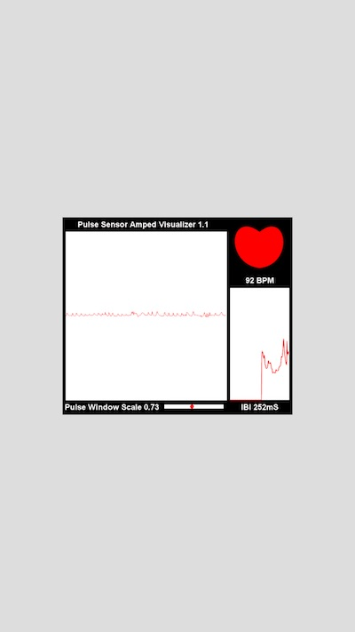

# AndroidSerial for Processing

This is a Processing-for-Android library offering the serial communication.

This library works on Android 3.1 or later since it uses Android USB Host API.

This library also includes [usb-serial-for-android](https://code.google.com/p/usb-serial-for-android/downloads/list) containing FTDI serial driver and USB CDC/ACM serial driver (for Arduino). The library still has some issues and also has bunch of improvements according to the google code site. I will update the library when the newer version is released.

Note that this version is alpha release.

## How to use

Build the source code (see below) or download a binary from [the release page](https://github.com/inventit/processing-android-serial/releases).

Unzip `AndroidSerial-distribution.zip` and copy all files including `AndroidSerial` directory to your `libraries` folder (e.g. `~/Documents/Processing/libraries`).

If you already install the older version of `AndroidSerial` library, remove it prior to copying the new one.

The usage of the library is almost same as [processing.serial.Serial](http://processing.org/reference/libraries/serial/Serial.html) library.

The difference between processing.serial.Serial and this is a static method `list()`.

The following code does NOT work on the AndroidSerial library.

    println(Serial.list()); // processing.serial library

But this does work,

    println(Serial.list(this));

Other methods in processing.serial.Serial class should work without any changes.

## Example

You can get a working example from the [sparkfun's pulse sensor SEN-11574](https://www.sparkfun.com/products/11574).

 1. Install Android SDK Platform 23 or higher as well as Android SDK Tools and Android SDK Platform-tools or later (I tried Android SDK Platform 23/24, SDK Platform Tools 24.0.3, SDK Tools 25.2.2, and Processing 3.2.1)
 1. Install Android mode on your Processing environment
 1. Install this library (Unzip `AndroidSerial-distribution.zip` and copy all files including `AndroidSerial` directory to your `libraries` folder (e.g. `~/Documents/Processing/libraries`))
 1. Go to the [page](https://www.sparkfun.com/products/11574)
 1. Download the Processing sketch from `Documents` section
 1. Open the downloaded Processing sketch (not Arduino)
 1. On the Processing IDE, choose `Sketch` -> `Import Library` -> `Android Serial Library for Processing` (This will insert `import io.inventit.processing.android.serial.*;`)
 1. Modify the code as below (see [here](https://github.com/WorldFamousElectronics/PulseSensor_Amped_Processing_Visualizer/blob/pr/1/PulseSensorAmpd_Processing_1dot1/PulseSensorAmpd_Processing_1dot1.pde) for the source code available at the sparkfun site)

        L9: // import processing.serial.*; // comment out
        L57: println(Serial.list());    // print a list of available serial ports
                     | (add `this`)
                     v
        L57: println(Serial.list(this));    // print a list of available serial ports

        L61: port = new Serial(this, Serial.list()[0], 115200);  // make sure Arduino is talking serial at this baud rate
                     | (add `this`)
                     v
	    L61: port = new Serial(this, Serial.list(this)[0], 115200);  // make sure Arduino is talking serial at this baud rate

 1. Please make sure that you need to check and modify the index of `Serial.list(this)` at the line 62 in order to specify the valid port name
 1. Create `res/xml` directories under the opened sketch directory (e.g. `~/Documents/Processing/PulseSensorAmpd_Processing_1dot1`)
 1. Copy `examples/PulseSensor11574/res/xml/device_fileter.xml` to the created directory (e.g. `~/Documents/Processing/PulseSensorAmpd_Processing_1dot1/res/xml`)
 1. Copy `examples/PulseSensor11574/AndroidManifest.xml` to the opened sketch directory (e.g. `~/Documents/Processing/PulseSensorAmpd_Processing_1dot1`)
 1. Connect your Android device to your computer and Run the code
 1. The application may report `Unexpected error` on your Android screen but you can ignore it (tap `OK`)
 1. Disconnect the Android device from the computer and connect your FTDI device or Arduino to the Android device with USB cable
 1. Android asks you to choose an application to launch, then choose your application (e.g. `PulseSensorAmpd_Processing_1dot1`)
 1. Finally, you will see the same screen as your computer!

** Screenshot  on Galaxy J **

## How to build

You can build the project source code though you can download the built binary from [our SourceForge project page](https://sourceforge.net/projects/procandser/).

Prior to building the project, you need to install the following software:

 1. JDK 6+ (Any JDK will be available)
 1. [Apache Maven](http://maven.apache.org/) (Choose the latest one if possible)
 1. [Gradle](https://gradle.org) is required if you run `update_libs.sh`, which downloads and builds the other revision of `usb-serial-for-android` source code than `b96f9ca`

Then run the following command under the root of the project:

    mvn clean deploy

And you can find the artifact file named `AndroidSerial-distribution.zip` at `target` directory.

## Directory Structure
The directory structure of this application is as follows:

    |-- images
    |-- libs
    |   |-- processing
    |   |   `-- android-core
    |   |       `-- android-mode-0252
    |   `-- com
    |       `-- hoho
    |           `-- usb-serial-for-android
    |               `-- b96f9ca
    |-- src
    |   |-- main
    |   |   |-- assembly
    |   |   |-- examples
    |   |   |   `-- PulseSensor11574 (X)
    |   |   |   |   `-- res
    |   |   |   |      `-- xml
    |   |   |-- java
    |   |   `-- resources
    |   `-- test
    |       |-- java
    |       `-- resources

(X) is a working example for Sparkfun's Pulse Sensor SEN-11574

## Source Code License

All program source codes are available under the MIT style License.

Copyright (c) 2016 Inventit Inc.

Permission is hereby granted, free of charge, to any person obtaining a copy of this software and associated documentation files (the "Software"), to deal in the Software without restriction, including without limitation the rights to use, copy, modify, merge, publish, distribute, sublicense, and/or sell copies of the Software, and to permit persons to whom the Software is furnished to do so, subject to the following conditions:

The above copyright notice and this permission notice shall be included in all copies or substantial portions of the Software.

THE SOFTWARE IS PROVIDED "AS IS", WITHOUT WARRANTY OF ANY KIND, EXPRESS OR IMPLIED, INCLUDING BUT NOT LIMITED TO THE WARRANTIES OF MERCHANTABILITY, FITNESS FOR A PARTICULAR PURPOSE AND NONINFRINGEMENT. IN NO EVENT SHALL THE AUTHORS OR COPYRIGHT HOLDERS BE LIABLE FOR ANY CLAIM, DAMAGES OR OTHER LIABILITY, WHETHER IN AN ACTION OF CONTRACT, TORT OR OTHERWISE, ARISING FROM, OUT OF OR IN CONNECTION WITH THE SOFTWARE OR THE USE OR OTHER DEALINGS IN THE SOFTWARE.

## Dependencies

 * [usb-serial-for-android](https://code.google.com/p/usb-serial-for-android/) ... LGPL, USB serial driver for Android
 * [Processing Core](http://wiki.processing.org/w/FAQ#Is_Processing_Open_Source.3F_How_.27bout_some_code.3F) ... LGPL, Processing core library
 * [Android](http://source.android.com/source/licenses.html) ... ASL 2.0, Android API Library
 * [SLFJ Android](http://www.slf4j.org/android/) ... MIT, Logging framework
 * [Robolectric](https://github.com/robolectric/robolectric/) ... Android testing library (TEST USE ONLY)
 * [Mockito](https://code.google.com/p/mockito/) ... Mock testing library (TEST USE ONLY)

## Change History

0.2.0 : September 23, 2016

 * Rename package to `io.inventit.processing.android.serial`
 * Processing 3.2 support
 * Use the latest version of [usb-serial-for-android](https://github.com/mik3y/usb-serial-for-android)
 * Android Mode 0252 support

0.1.0-alpha : February 29, 2016

 * Processing 3 support and Processing 2 is no longer supported

0.0.2-alpha : June 20, 2013

 * Fixes an [issue](https://github.com/inventit/processing-android-serial/issues/1) where [Arduino Due](http://arduino.cc/en/Main/arduinoBoardDue) cannot be detected by [usb-serial-for-android](https://code.google.com/p/usb-serial-for-android/) library. Now all Arduino devices are accepted (but not sure they all work properly. [Give us your feedback](https://github.com/inventit/processing-android-serial/issues))
 * Adds unit testing libraries, [Robolectric](https://github.com/robolectric/robolectric/) and [Mockito](https://code.google.com/p/mockito/)
 * The release binary has been moved to [our SourceForge project page](https://sourceforge.net/projects/procandser/)

0.0.1-alpha : June 10, 2013

 * Initial
